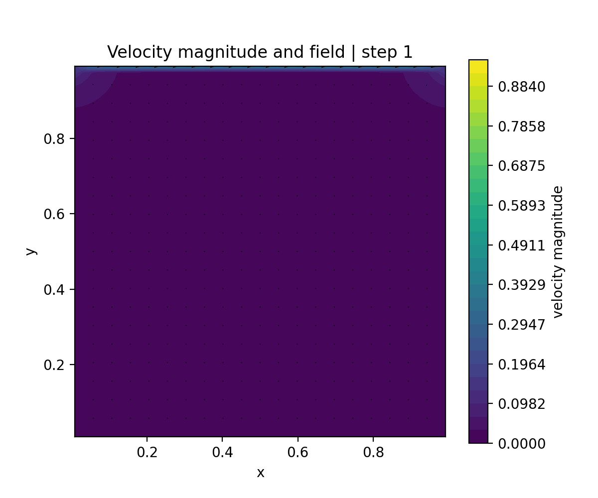
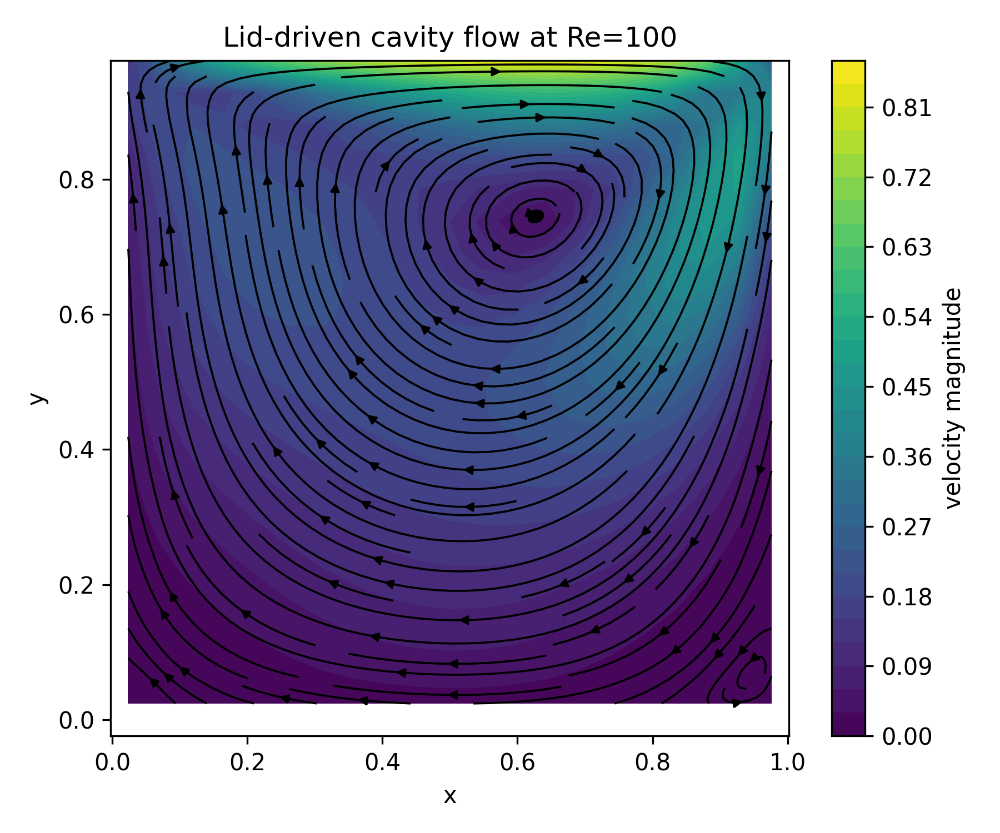
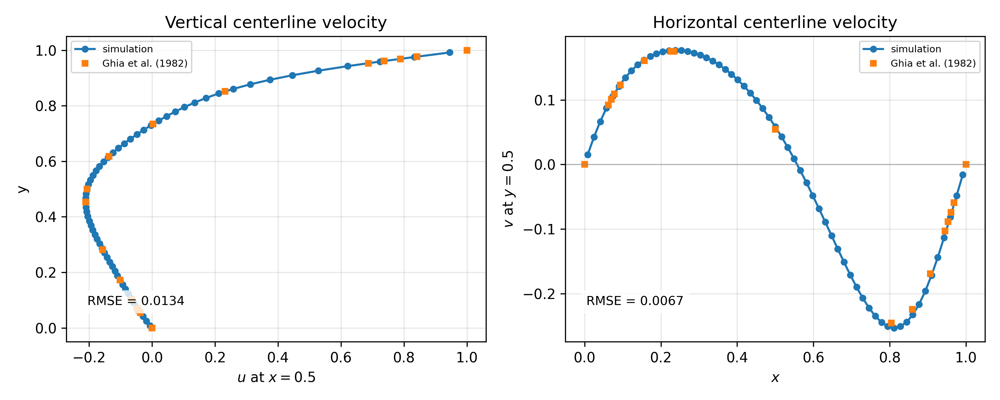
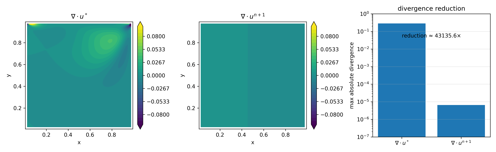

# 2D Incompressible Navier–Stokes Solver
### MAC Staggered-Grid Projection Method

## Overview



This project implements a 2D incompressible Navier–Stokes solver from scratch in Python using a finite-difference projection method on a ghost-cell MAC staggered grid.

The final simulation reproduces the classical lid-driven cavity benchmark at Re = 100 and compares the centerline velocity profiles against the reference data of Ghia et al. (1982).

## Key Results







## Numerical Methods

- 2D incompressible Navier–Stokes equations
- Finite-difference discretization
- Ghost-cell MAC staggered grid
- Explicit advection–diffusion predictor
- Pressure Poisson equation
- SOR iterative Poisson solver
- Pressure projection for incompressibility enforcement
- Divergence diagnostics before and after projection
- Benchmark validation against Ghia et al. (1982)

## Repository Structure

```text
run_projection_solver.py
Final Re=100 lid-driven cavity simulation. Generates the benchmark plots and velocity GIF.

core.py
Core numerical routines: MAC grid setup, ghost-cell boundary conditions, predictor step, Poisson solver, projection step, and time integration.

diag.py
Ghia et al. benchmark data and error computation.

plots.py
Visualization routines for velocity fields, streamlines, projection diagnostics, benchmark comparison, and animation.

grid_convergence_study.py
Grid-refinement study for N = 21, 31, 41, 51, 61.

test/test_operator_consistency.py
Sanity checks for MAC-grid shapes, ghost-cell boundary conditions, discrete divergence, pressure gradient, and projection behavior.

experiments/
Archived development scripts documenting earlier collocated-grid and debugging experiments.
```

## Development Highlights
During development, several numerical issues commonly encountered in projection-based incompressible solvers were investigated:

- checkerboard pressure artifacts in collocated grids
- pressure–velocity decoupling
- divergence persistence after projection
- Neumann Poisson solvability and pressure gauge fixing
- Jacobi vs. SOR convergence behavior
- boundary-condition consistency on staggered grids

Several solver architectures were explored, including collocated-grid formulations, MAC staggered grids, and alternative pressure-correction approaches.

## How to Run
python run_projection_solver.py

This generates:
velocity_evolution.gif
figures/streamlines_re100.png
figures/ghia_centerline_comparison_re100.png
figures/projection_diagnostics_re100.png

## Technologies
- Python
- NumPy
- Matplotlib